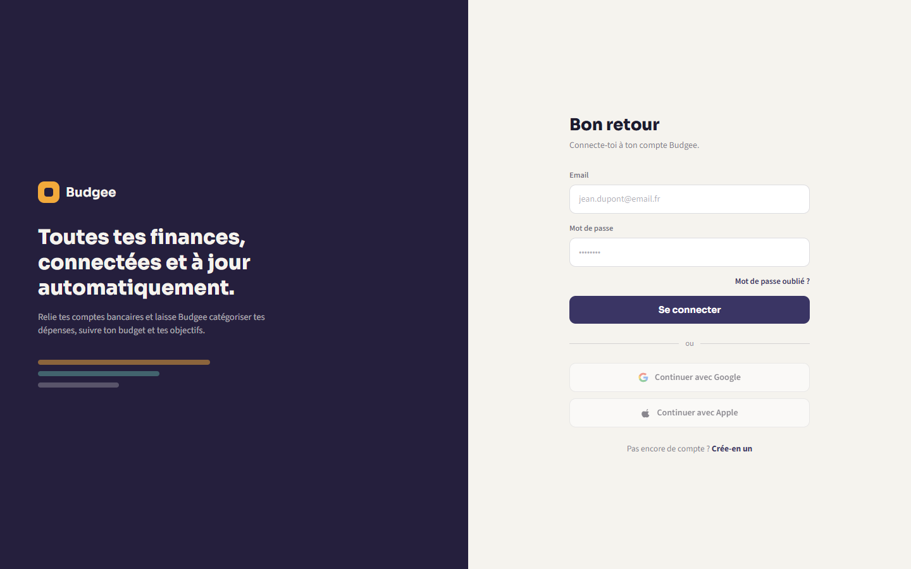
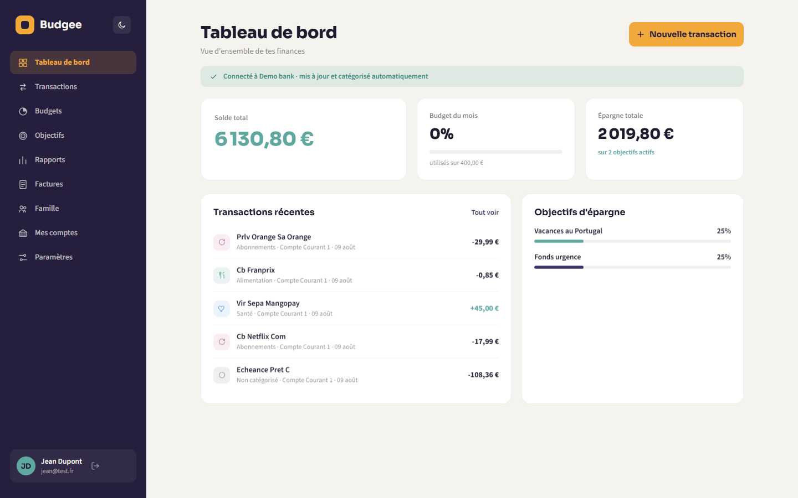
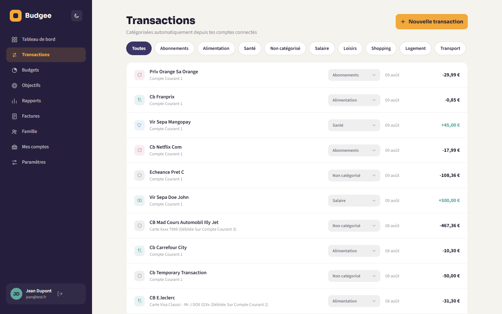
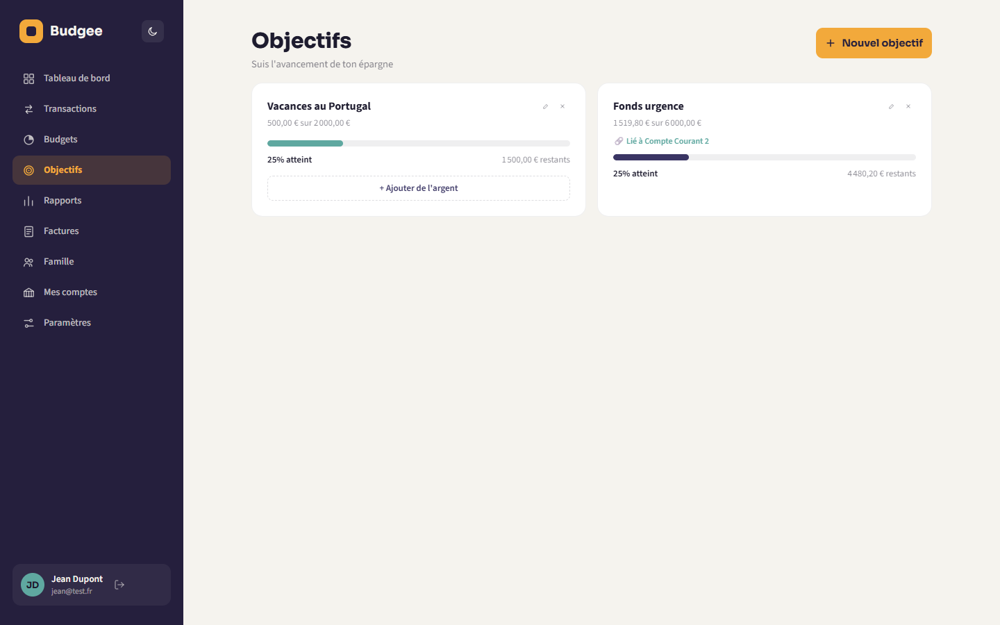
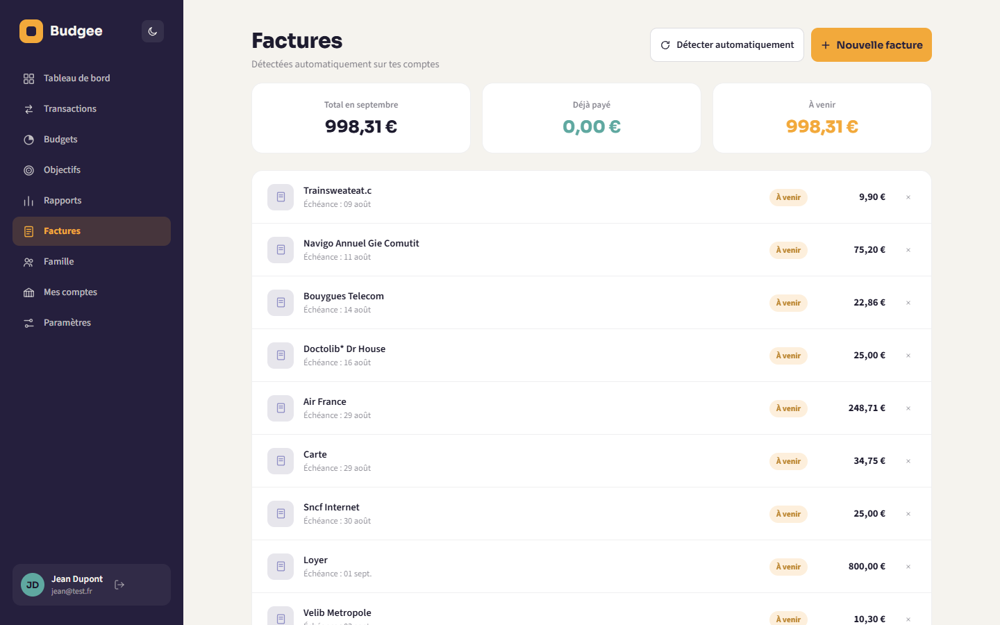
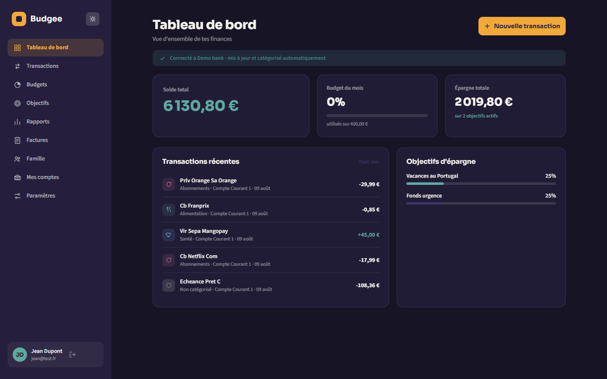

<div align="center">

# Budgee

**Gestion de budget personnel et familial, connectée à vos vraies banques.**

Suivi des dépenses, budgets par catégorie, objectifs d'épargne et détection automatique des factures récurrentes — avec une synchronisation bancaire en temps réel via [Bridge API](https://bridgeapi.io) (agrégation open banking).

[](https://github.com/JulBea/Budgee/actions/workflows/ci.yml)
[](https://www.typescriptlang.org/)
[](https://react.dev/)
[](https://nodejs.org/)
[](https://expressjs.com/)
[](https://www.postgresql.org/)
[](https://www.prisma.io/)
[](LICENSE)

</div>

---

## Sommaire

- [Aperçu](#aperçu)
- [Fonctionnalités](#fonctionnalités)
- [Architecture](#architecture)
- [Stack technique](#stack-technique)
- [Sécurité](#sécurité)
- [Démarrage rapide](#démarrage-rapide)
- [Structure du projet](#structure-du-projet)
- [Roadmap](#roadmap)

## Aperçu

<table>
<tr>
<td width="50%"></td>
<td width="50%"></td>
</tr>
<tr>
<td width="50%"></td>
<td width="50%"></td>
</tr>
<tr>
<td width="50%"></td>
<td width="50%"></td>
</tr>
</table>

Budgee est une application full-stack de gestion budgétaire pensée pour un usage personnel et familial. Elle se connecte aux comptes bancaires réels via l'API d'agrégation [Bridge](https://bridgeapi.io) pour récupérer soldes et transactions automatiquement, les catégorise, détecte les prélèvements récurrents et donne une vision claire du budget mensuel et des objectifs d'épargne — sans ressaisie manuelle.

Le projet est organisé en monorepo npm avec une app web (React), une API (Node/Express) et une base mobile (React Native, en pause), autour d'un schéma de données partagé.

## Fonctionnalités

**Comptes & transactions**
- Connexion bancaire réelle via Bridge (OAuth-like Connect Sessions), synchronisation des comptes et transactions
- Webhooks signés (HMAC) pour la mise à jour en temps réel des données bancaires
- Catégorisation automatique des transactions (mapping des ~120 sous-catégories Bridge vers 8 catégories métier), avec correction manuelle possible

**Budgets & objectifs**
- Budgets mensuels/annuels par catégorie avec suivi de consommation
- Objectifs d'épargne liés à un compte bancaire réel : le montant épargné se met à jour automatiquement au solde du compte
- Édition et suppression des objectifs

**Factures récurrentes**
- Détection automatique des abonnements et factures récurrentes par analyse des écarts temporels et de la régularité des montants sur l'historique de transactions
- Ajout manuel en complément, total mensuel des charges récurrentes

**Famille**
- Membres du foyer avec suivi de dépenses individuel

**Rapports & tableau de bord**
- Répartition des dépenses par catégorie, tendances mensuelles
- Vue d'ensemble du solde total, code couleur dynamique (positif/négatif)

**Expérience**
- Thème clair/sombre avec palette cohérente sur toute l'application
- Transitions et graphiques animés (chargement progressif, sobre et cohérent avec la charte graphique)

## Architecture

```
                         ┌─────────────────────┐
                         │      Bridge API      │
                         │ (agrégation bancaire) │
                         └──────────┬───────────┘
                            webhooks │ REST
                                     ▼
┌────────────────┐          ┌───────────────────┐          ┌──────────────────┐
│   apps/web      │  HTTP    │     apps/api       │  Prisma  │    PostgreSQL     │
│  React + Vite   │◄────────►│  Node + Express    │◄────────►│                   │
│  TypeScript     │  session │  TypeScript        │          │                   │
└────────────────┘   cookie  └───────────────────┘          └──────────────────┘
        ▲
        │ types & logique partagés
        ▼
┌────────────────┐
│ packages/shared │
└────────────────┘
```

L'authentification repose sur des sessions serveur (cookies httpOnly) stockées en base via `connect-pg-simple`, plutôt que sur des JWT côté client.

## Stack technique

| Couche | Technologies |
|---|---|
| Frontend | React 19, TypeScript, Vite, React Router |
| Backend | Node.js, Express, TypeScript |
| Base de données | PostgreSQL, Prisma ORM |
| Auth | bcrypt, express-session, connect-pg-simple, rate limiting, Helmet |
| Agrégation bancaire | Bridge API (Connect Sessions, webhooks HMAC) |
| Tests & CI | Vitest, GitHub Actions |
| Mobile (WIP) | React Native, Expo |

## Sécurité

- Mots de passe hashés avec bcrypt, jamais stockés en clair
- Sessions serveur en base (pas de token sensible côté client), cookies `httpOnly`/`sameSite`
- Rate limiting sur les routes d'authentification pour limiter le brute-force
- En-têtes de sécurité HTTP via Helmet
- Signature HMAC vérifiée sur chaque webhook Bridge entrant
- Secrets et identifiants API uniquement en variables d'environnement (`.env`, jamais commités — voir `.env.example`)

## Démarrage rapide

### Prérequis

- Node.js 20+
- PostgreSQL (local ou via Docker)
- Un compte [Bridge API](https://dashboard.bridgeapi.io) (sandbox gratuite) pour la synchronisation bancaire

### Installation

```bash
npm install
```

### Configuration de l'API

```bash
cp apps/api/.env.example apps/api/.env
```

Renseigner dans `apps/api/.env` :
- `DATABASE_URL` — connexion PostgreSQL
- `SESSION_SECRET` — chaîne aléatoire longue
- `BRIDGE_CLIENT_ID` / `BRIDGE_CLIENT_SECRET` / `BRIDGE_WEBHOOK_SECRET` — identifiants sandbox Bridge

Puis appliquer les migrations :

```bash
npm run prisma:migrate --workspace=apps/api
```

### Lancer les applications

```bash
npm run dev:api      # API sur http://localhost:4000
npm run dev:web      # Web sur http://localhost:5173
npm run dev:mobile   # Expo (scanner le QR code avec Expo Go)
```

### Tests

```bash
npm run test         # tests unitaires de l'API (Vitest)
```

## Structure du projet

```
apps/
  web/       React (Vite) — application web
  mobile/    React Native (Expo) — application mobile (pause)
  api/       Node.js/Express + Prisma — API backend
packages/
  shared/    Types et logique partagés entre les apps
```

## Roadmap

- [ ] Notifications (rappels de factures à échéance)
- [ ] Export des rapports (PDF/CSV)
- [ ] Application mobile complète
- [ ] Multi-devises

---

<div align="center">

Développé par [Jules Beauvais](https://github.com/JulBea)

</div>
